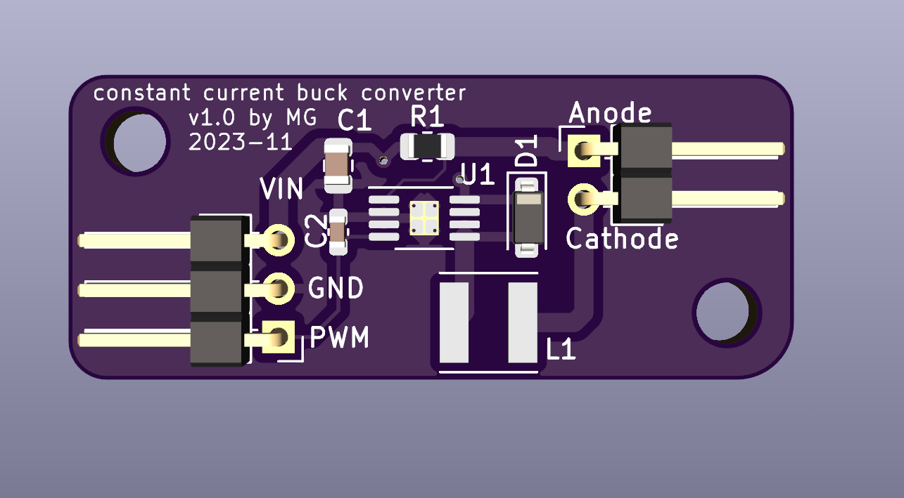
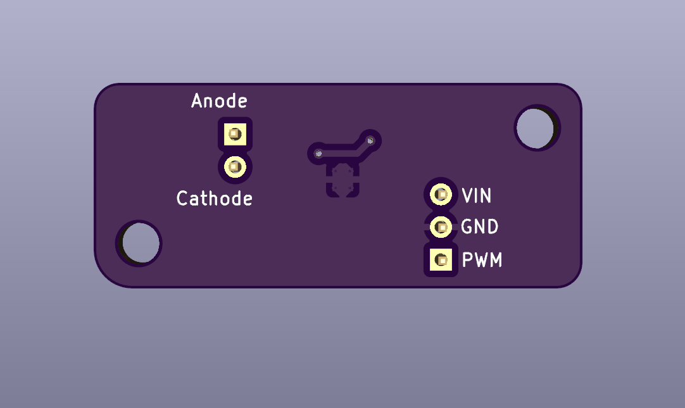

# constant-current-driver
A constant current driver up to 1.5A to drive LEDs

### Requirements for rev 1.0
* efficient step-down converter, not linear
* high frequency
* cheap IC
* PWM control
* up to 1.5A in voltage range 5-24V output

### Known issues in rev 1.0
* none

### Pictures (rev 1.0)

